去年比赛的五级流水 CPU 使用的是简单静态分支预测，即默认不跳转，今年在更换 BRAM 存储器之后，运行频率得到了质的飞跃，从 180 MHz提升到了现在的 250 MHz，在优化频率方面的工作貌似已经到达极限，最近开始学习动态分支预测的知识，更换掉之前的静态分支预测，从预测准确率方面提升我们 CPU 性能。

<!-- more -->

## 分支预测的目的

在冯诺依曼的存储指令结构下，指令的执行包含有三种冒险： **结构冒险、数据冒险和控制冒险** 。

* 结构冒险是指硬件部件不足导致指令无法继续执行；
* 数据冒险是指指令所需要的数据受到前面指令的影响，暂时无法取用，从而导致指令无法继续执行；
* 控制冒险是指 **分支指令在控制程序的过程中中断指令流，** 从而导致程序无法继续执行。

上面提到的三种冒险对于处理器的性能而言是巨大的威胁，其中结构冒险可以通过添加硬件（如增加存储单元，增加运算单元）来解决，数据冒险可以通过旁路转发技术来部分解决（load-use 冒险仍旧没法解决，而且长流水线中旁路转发也不能完全解决load-use之外的数据冒险问题，必须使用 stall 机制来解决），而分支冒险最难解决。

分支指令有中断指令流的能力，而指令的持续流入是处理器发挥性能的基础。这就像做菜一样，指令就是做菜的原材料，没有原材料，一个厨师的厨艺（对应处理器的运算能力）再高也无法施展。换句话说， **指令的吞吐率决定了处理器性能的上限，** 而分支指令降低了指令的吞吐率，降低了处理器性能的上限，因此控制冒险应该受到所有处理器设计者的重点关注。

我们现在进行量化计算，来说明分支预测的重要性。假如现在有一个经典五级流水线CPU，它没有分支预测功能，当遇到分支指令时，它停顿分支指令之后的所有流水段，直到分支指令运行到访存段才重新启动流水线（此时，访存指令在 EX 执行阶段拿到了跳转结果，即“跳” or “不跳”，以及跳转的地址）。这种情况下每遇到一条分支指令，流水线损失三个周期，即分支指令之后三个周期处理器无法执行完任何一条指令。这样一来，当在一段代码中有 20% 的指令是分支指令时，处理器 CPI 从理想状况下的 1 降低到 0.8+0.2*4=1.6，处理器的速度大大地降低了。

根据上一段的计算结果容易发现， **如果对分支指令处理得不好，处理器的性能会受到很大影响** ，因此处理器的设计者们提出用“分支预测”的方法来应对这个问题。

分支预测技术是指处理器在遇到分支指令时不再傻傻地等待分支结果，而是直接在取指阶段预测分支“跳”或者“不跳”以及跳转目标地址， 目的是**根据预测结果来实现不间断的指令流，从而让处理器的 CPI 再度接近理想情况中的 1**  。

从上一段的表述中我们可以知道， **分支预测就是预测两件事** ：

* **分支指令的跳转方向**
* **分支指令的跳转目标地址**

## 分支方向的预测

### 1、静态分支预测

要进行分支预测，就要预测分支跳还是不跳。最朴素的想法是预测一直跳或者一直不跳，这样的方法虽然简单，但是也比完全不预测要高明。完全不预测是 100% 地要阻断流水线，而预测一直跳或者预测一直不跳还有机会预测对，预测到就是赚到。预想一个 1000次 的 for 循环，这个循环前 999 次都是跳转而最后一次不跳转，如果处理器设置为预测一定跳转，那么在执行这段指令的时候其准确率高达 99.9%，性能远远高于不做预测的处理器。

基于量化研究方法的思想，HP 在他们的著作中说当前世界上大概有 20% 的代码是分支指令，其中跳转和不跳转的比例是 1：1 。把这个数据代入到上一段说的预测方法中去，处理器的CPI = 0.8 + 0.1 × 1 + 0.1 × 4 = 1.3  *，* 效果显著优于完全不做预测的机器。

在上面的基础上略加思考，我们发现很多分支指令是有规律的，比如 for 代码段的最后一条分支指令，这条分支指令绝大部分时间是向后跳转的，而 for 代码又总是出现，因此提出这么一个方法：向后跳转的分支总是执行，向前跳转的分支总是不执行。这样的假设是基于实际代码情景的，事实证明这样做的效果不错。

### 2、根据最后一次结果进行预测（单 bit 计数器）

静态分支预测的方法虽然比不预测要好，但是性能并不能让人满意。比如预测一定跳转，如果碰到分支指令执行情况为 NNNNNN（ N 表示Not taken，不分支），那么错误率就高达 100% ，这样的情况是有可能发生的。静态就意味着不灵活，我们需要灵活一些的方法来解决问题，灵活的方法可繁可简，简单的方法就是根据上一次分支指令的执行情况来预测当前分支指令，如果上一次指令不跳转，那么下一次碰到这条指令就预测不跳转，用这个方法来预测 NNNNNN 的话，正确率可能高达 100%，这样的结果让人满意。

### 3、基于两位饱和计数器的预测

根据最后一次结果进行预测确实有一些效果，但是当它碰到 TNTNTN 这样的情况，正确率又可能会下降到 0%，还不如静态预测，静态预测还可能有 50% 及以上的正确率。

既要满足 NNNNNN 这样的情况，又要让 TNTNTN 这样的情况的结果不至于太难看，解决的办法是基于两位饱和计数器的预测。 **两位饱和计数器用一个状态机来表示** ，状态机如下图。

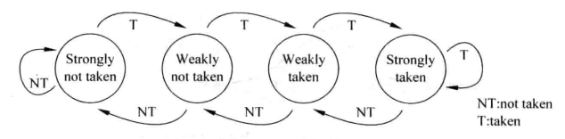

两位饱和计数器包含四个状态：00、01、10、11（有时候也会使用格雷码：00、01、11、10） 。其中  00、01 表示不跳转，10、11 表示跳转。

00 表示强不跳转，当计数器处于这个状态，分支预测不跳转，如果预测正确，计数器保持计数值，如果预测错误，那么状态转换成 01，即弱不跳转，此时，仍然预测分支不跳转，如果预测正确，状态转变回 00，如果预测错误，状态转变为弱跳转 10。

在弱跳转 10 的状态下，分支预测跳转，如果预测正确，状态转变为强跳转 11，如果预测错误，状态转变为弱不跳转 01。

在强跳转 11 的状态下，分支预测跳转，如果预测正确，状态保持不变，如果预测错误，状态转变为弱跳转 10。

上述的两位饱和计数器只是一种预测方法，其他的预测方法包括修改两位计数器的状态转移情况、增大计数器位数，对于两位饱和计数器自身而言，我们也可以通过设置不同的初始状态来区别别的两位饱和计数器。

下图是两种不同的两位计数器。

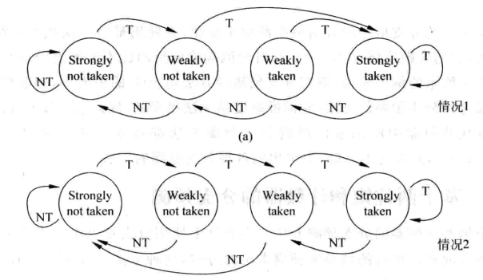

**虽然计数器的变种很多，但是事实证明两位饱和计数器是最坚挺的** 。如果增加计数器的位数，如增加到三位，它在指令分支情况快速变化的情况下表现很不好，同时会迅速增加硬件复杂度和存储资源的消耗。这里要指出一点，两位饱和计数器是针对单条指令的，即 **每一条分支指令都要有一个独立的两位饱和计数器** ，因此扩大计数器位数会引起存储量的迅速攀升。而改变两位计数器的状态转移逻辑，其他的情况也不如饱和计数器更加优越，HP 在他们的著作中做过测试， **两位饱和计数器在测试代码中准确率最高、最稳定** 。

上文说到“每一条分支指令都要有一个独立的两位饱和计数器”，这并不是自然而然的。其实上文提到的所有预测方法都是基于指令的PC值提出的，因此实际操作中每一条指令都会拥有一个计数器，在32位机器中这就要求存储空间2^{30} * 2 = 2^{31} = 2 Gb = 0.25 GB，这么大的存储空间是没法接受的。

有人也许会提出不要为每条指令都配备一个计数器，只需要在判断指令为分支指令时才配备计数器就好了。这样的做法是比较难实现的，为了在 IF 阶段快速预测，最简单的方法是直接用 PC 的若干位去索引预测表。这样不需要先判断“它是不是分支”，也不需要复杂查找，访问速度快。而如果只想给真正的分支指令分配预测项，就需要额外解决“当前 PC 是否命中某个已记录的分支项”这个问题，硬件会更复杂。这个做法有点类似 Cache 里面的全相联和直接映射，全相联/全比较的方法消耗巨量的硬件资源，而且严重拖慢运算的速度。

实际设计的时候为了解决上面提出的问题，设计人员提出类似 Cache 直接映射的方法，即**多条指令对应一个两位计数器**，对应规则使用 PC 的部分值（一般是中间 k 个 bit，对应 2^k 个计数器）。

下图是一种解决办法，用 PC 的部分值来寻址计数器。图中的 PHT 是指 **Pattern History Table** ，即模式历史表，“模式”就是说饱和计数器的状态， **PHT 类似 SRAM 结构** ，里面存有 2^{k} 个两位饱和计数器供查询使用。图中的 FSM update Logic 是 PHT 更新模块，现在不用关心这个模块。

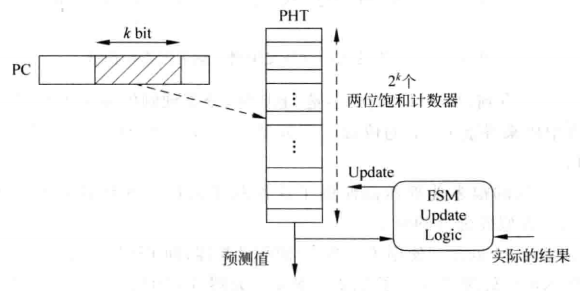

使用上图这种方式的好处是节省了计数器的存储空间，坏处是有可能出现这么一种情况，即多条分支指令同时寻址到一个 entry（把 PHT 中的一个计数器称为一个 entry ）这种情况被称为“别名”，当多条指令寻址到一个 entry ，并且它们的实际分支情况互不一样的时候，这个 entry 的预测结果和更新状况就会变得混乱，这样的情况被称为“破坏性别名”，如果指令之间互不影响，这样的情况被称为“中立别名”。

**“破坏性别名”对预测是不利的** ，需要想个办法来缓解问题。设计人员给出的办法是对整个 PC 进行变换，如 hash（哈希）操作使之转换成k位数值，然后再用 k 位数值去寻址 entry，这样操作之后分支指令再相撞的可能性就会降低（并不代表完全消失），下图是示意图。

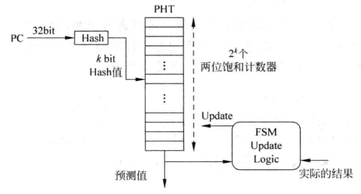

缓解的方法不一定要用 hash，不同的公司有不同的算法，有的算法可能非常复杂。

以上讲解的是两位饱和计数器的概念和实现方法，在实际操作中两位饱和计数器的正确率可以高达 98% ，但是再高一点就变得十分困难，因此现代的处理器不会直接使用这种方法。

### 4、基于局部历史的分支预测

**理论上讲，只要分支指令有规律，就应该可以进行预测** ，但是基于两位饱和计数器的分支预测方法并不是一个完美的方法，对于很有规律的分支指令两位饱和计数器还是会产生坏结果，考虑下图中的分支指令：

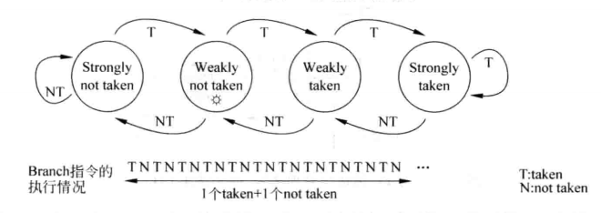

对于上面这条 TNTN 交替的分支指令，如果两位饱和计数器的初始值定为**弱不跳转**，那么预测正确率会跌至谷底——0%，如果初始值定为弱跳转，那么正确率是 50%，这样的结果是不能接受的，因为这条 branch 指令明明是很有规律的，让一个小孩来看，他也能100%预测分支结果，因此需要更好的机制来捕捉指令的规律。

**设计人员给出的答案是“记录历史”** 。小孩为什么能预测分支结果？因为他看到了这条指令之前都是跳和不跳交替循环的，所以他判断之后也会继续交替。因此设计人员会想到模拟这一个行动，用一个寄存器来记录一条指令再过去的历史状态，当这个历史状态很有规律时，就可以为分支预测提供一个可以利用的工具，这样的寄存器被称为“分支历史寄存器”，英文是 **Brach History Register（BHR）** ，这种预测方法称为基于局部历史的预测方法。

对于一条指令而言，通过将它每次的结果移入 BHR 寄存器，就可以记录这条分支指令的历史状态了，如果这条分支指令很有规律，那么就可以使用BHR寄存器对这条分支指令进行预测，这种分支预测方法的工作机制如下图：

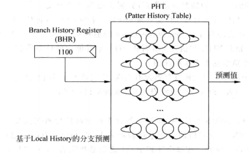

**这种方法也被称为自适应的两级分支预测** ，一个位宽为 n 的 BHR 可以记录一条指令过去 n 次的执行情况，对一个 BHR ，用多个两位饱和计数器去捕捉规律，因此上图包含一个 PHT ，这里的 PHT 和之前不一样，之前的 PHT 含有全部指令的计数器，而这里的 PHT 保存的是针对一条指令的多个计数器，这些计数器由 BHR 寻址，根据 BHR 的不同可以选出不一样的计数器，从而捕捉到规律，下面举一个例子来说明它究竟是如何工作的：

考虑两位 BHR，仍然查看 TNTN 循环交替的分支指令，在前两次执行情况为 TN 时，BHR的值为 10，寻址第二个计数器，假设这个计数器的初始状态是弱不跳转，那么经过这一次的指令它的状态转换为弱跳转，然后 BHR 被更新为 NT，寻址第一个计数器，假设这个计数器初始状态是弱跳转，那么经过这一次的指令它的状态转换为弱不跳转，继续执行分支，当前 BHR 指令是 TN ，再度寻址到第二个计数器，此时它的状态是弱跳转，这一次我们预测成功了，如果继续推演，容易发现接下来的每次预测我们都是正确的。

在实现这个方法的时候， **还需要考虑一个关键性的参数——BHR 的位数** 。在上面的例子中我们用两位 BHR 完美实现了预测，但是再观察一下，例子在找寻指令规律的时候实际上只用了两个计数器，即只用了第二个和第一个计数器，两位 BHR 对应四个计数器，所以还有两个计数器没有用到，这说明在针对这个例子的情况时 BHR 的位数多了，实际上只需要一位BHR就能实现上面例子的完美预测。那么怎么找到这个能完美预测指令的最小位数呢？《超标量处理器设计》告诉我们在一个有规律的执行序列里， **完美的 BHR 位数就刚好等于序列里最长单数字序列的位数** ，举个例子，比如 001111001111.... 这个循环例子，其中最长单数字序列是 1111，位数为 4，也即在这个循环例子里每四个数后面的数都是确定的，所以 BHR 的最小位数是 4 。

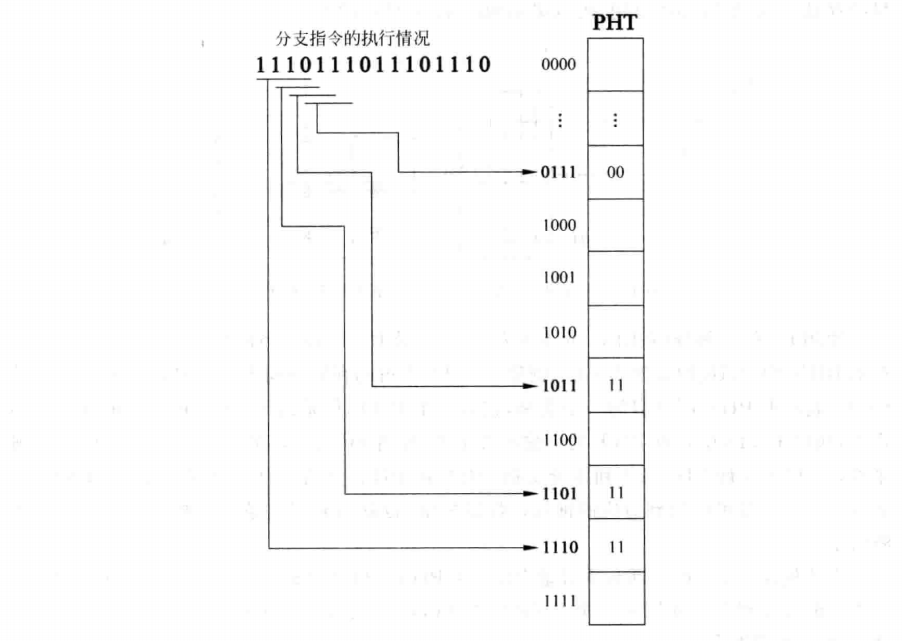

**BHR 的位数可以很长，只要位数比最长单数字序列的位数要多，BHR 就可以完美实现预测** 。上图就是一个例子，它用了4位BHR来预测，按照上文的说法，这个序列里每三个数后面的数都是确定的，循环位数是三，但是把这个循环变长一点也没关系，用四做循环位数也是可以的。但是要注意，BHR太长会有坏处，BHR 越长，需要的 PHT 就大，而且训练时间也长，训练时间是指从进入分支循环开始到能实现完美预测的时间。

到目前为止这个方法有个隐性的基础，就是每条指令都有属于自己的 BHR 和 PHT ，正如前文中说的一样，为每条指令都配备一组 BHR、PHT 太奢侈了，所以设计人员和操作两位饱和计数器方法一样操作本节的方法，下图说明了这一个操作过程：PHTs 是多个 PHT 组合合成的存储单元，我们用 PC 的一部分来寻址 PHT ，即找到当前指令对应的模式历史表，然后再用 PC 的一部分来寻址 BHR ，即找到当前指令对应的分支历史寄存器，然后根据 BHR 的值在 PHT 中找到要使用的那个两位计数器。

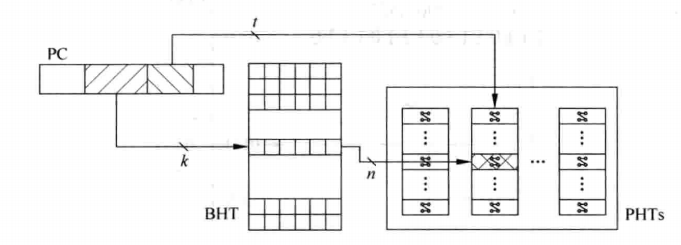

优点是节省了 BHR、PHTs 的空间，缺点是使用 PC 的一部分来寻址容易发生多条指令寻址到同一个 BHR 或者 PHT ，如果发生这样的“别名”事件，就容易干扰到正常的预测工作，容易影响到处理器的处理效率。针对这样的情况，对PC整体进行 hash（哈希）以产生两个比较短的数，用这两个数来寻址 BHR、PHT 即可以缓解“别名”的问题。

由于只考虑被预测的分支指令自身在过去的执行情况，所以称之为基于局部历史的分支预测法。理论上讲，任何一条分支指令，只要它的执行是有规律的，那就可以用这种方法进行预测， **但是现实情况是当一条指令的循环周期太大，就需要一个宽度很大的 BHR 才能实现完美预测，这会导致过长的训练时间，并且PHT也会占用过多的资源，在这真实世界中是无法接受的** 。

比如对于一条跳转 99 次加不跳转 1 次的指令，这个方法无法实现完美预测，但是这种方法相比于两位饱和计数器方法已经进步了很多。不过在有些时候，一条分支指令的执行情况不仅和它自身有关，还和它前面的指令的执行情况有关，基于局部历史的预测方法不能捕捉到这种全局的规律。

### 5、基于全局历史的分支预测

考虑下面一段代码：

```c
if(aa == 2)
    aa = 0;
if(bb == 2)
    bb = 0;
if(aa != bb)
    cc = 0;
```

分析这一段代码，容易发现当第一条、第二条分支指令不执行时（即操作 aa = 0、bb = 0），第三条指令一定会执行（即不操作 cc = 0），这样的关系用基于局部历史的分支预测方法是永远也发现不了的，因此要引入新的方法——基于全局历史的分支预测。

在基于局部历史的分支预测中，我们用很多的 BHR 来记录各条指令的历史记录，而在基于全局历史的分支预测中，只有一个历史记录寄存器，即 **Global History Register（GHR）** ，用 GHR 替代 BHR 来寻址 PHT。

用基于全局历史的预测方法来预测上面的代码：假设循环往复地执行上面的指令，GHR 位数为三，那么经过一段时间的训练，GHR为x00时（假设数据从 GHR 右端移入），即第一条、第二条指令不跳转时，根据 GHR 寻址得到的两位饱和计数器一定是“跳转”，这时候就捕捉到了分支指令的规律。

下图是实现基于全局历史的分支预测的示意图，其中用 PC 部分做hash然后寻址的理由和前两节是一样的。

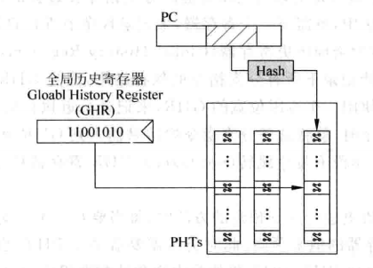

值得注意的是，基于全局历史的分支预测在预测如单条指令为 TNTNTN 循环的情况时，其表现很可能不如基于局部历史的预测，原因是该条指令对应的 PHT 可能受到前面分支指令的影响。出现这种问题的原因是不是所有分支指令都适合用全局的视角去看待， **在真实世界中有些指令适合基于局部历史，有些指令适合基于全局历史，因此设计人员提出了更激进的预测方法，那就是“竞争的分支预测”** 。

### 6、竞争的分支预测

到目前为止我们学习了“基于局部历史的分支预测”和“基于全局历史的分支预测”，但是实际情况中需要灵活使用两种方法，因此提出“竞争的分支预测”，即让两种方法互相竞争，最终决定对某一条分支指令使用“基于局部”还是“基于全局”。

其实现思想就像两位饱和计数器一样，两位饱和计数器用两位计数器来指示跳或不跳，竞争的分支预测可以使用两位数来指示使用“基于局部”或“基于全局”，使用的寄存器被称为 **Choice PHT（CPHT）** 。下图是一种结构图，图中的小圆圈代表对 PC 做 hash 等处理，其动作是用 PC 经过处理值来寻址 CPHT，用寻到 CPHT 来选择一个预测结果。

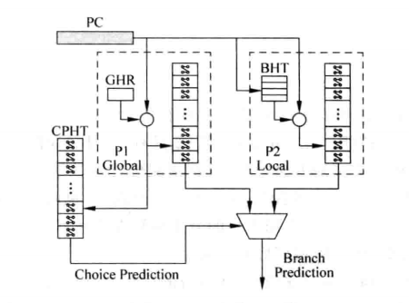

和两位饱和计数器用状态机来表示状态迁移一样，CPHT 同样有状态迁移规则，同样用状态转移图表示。下图中状态转移所用到的信息表示两种方法的预测情况，比如 1/0 就表示“基于全局”的方法正确，而“基于局部”的方法错误。在这个转移算法中只有一个方法连续错误两次，同时另一个方法连续正确两次，CPHT 才会改变预测时选择的方法。

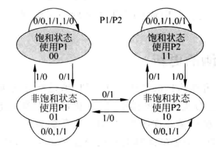

值得注意的是，在上面的实现结构中我们用 GHR 和 PC 的综合信息来寻址 CPHT，这并不是规定的做法，实际上如何寻址 CPHT 也是因团队设计而异，**不同团队设计的寻址方法不一样，其效果也不一样，而这正是架构师存在的意义**。

## 分支预测技术的演进

这是一个“从抽象到精细，从局部到全局”过程：

**1、基于饱和计数器的分支预测：简单抽象的智慧与局限**

每个分支指令通过PC值索引到PHT中的特定计数器，该计数器承载着指令的 **历史行为抽象** 。这种方法的核心思想是将复杂的历史执行轨迹 **压缩为单一的统计量** ——一个反映”跳转倾向”的数值。

 **优势** ：实现简单，硬件开销小，能够捕获基本的行为趋势。

 **根本缺陷** ： **信息过度压缩** 。将丰富的历史模式简化为单一数值，必然丢失重要的上下文信息和时序特征，导致预测精度受限。

**2、基于局部历史的分支预测：精细化建模的得与失**

针对每个分支指令维护专属的 **历史模式表** ，不同的历史序列对应不同的饱和计数器。这种方法摒弃了粗粒度的统计抽象，转而采用 **细粒度的模式识别** 。

 **优势** ：能够识别和利用指令特有的执行模式，预测精度显著提升。

 **根本局限** ： **过度局部化** 。每个指令孤立地依据自身历史进行预测，忽略了程序执行的**全局上下文**和 **指令间的相关性** ，在复杂控制流中表现不佳。

**3、基于全局历史的分支预测：局部与全局的智慧融合**

通过全局历史寄存器(GHR)记录程序的 **整体执行轨迹** ，然后结合分支指令的PC值共同索引PHT。这种设计体现了 **系统性思维** ：既保持每个分支的个性化预测表，又将其置于全局执行上下文中。

 **核心洞察** ：分支行为不是孤立的，而是 **程序全局状态的函数** 。当前分支的跳转决策既依赖于自身特性，更取决于程序当前的执行路径和状态。

 **设计哲学** ：在**局部精确性**与**全局一致性**之间找到最佳平衡点，实现了” **既见树木，又见森林** “的预测策略。

最终的启示是： **最优的系统设计往往不在于单一维度的极致，而在于多个维度的智慧平衡** ，这也是我对架构设计感兴趣的原因之一。
