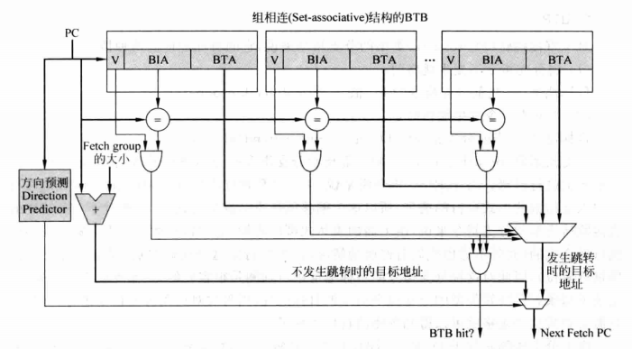
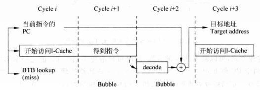
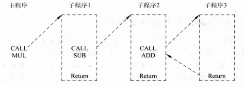
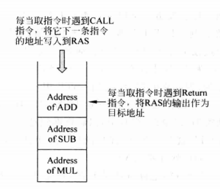
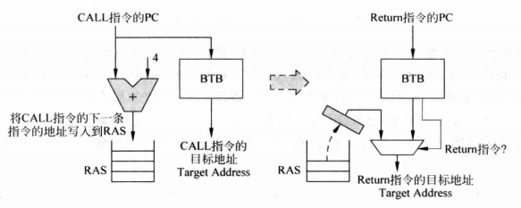
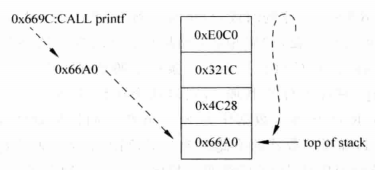

我们在“动态分支预测（一）”的文章里面提到了在静态和动态分支预测中，有关分支指令“是否跳转”的问题，重点介绍了基于局部历史和全局历史的分支预测，现在我们开始探讨“跳转何处”的问题。

<!-- more -->

## 分支地址的预测

有些人可能会感到奇怪，不明白为什么需要预测地址。首先明确 **分支指令大体上有两种** ：

* 一种是基于PC的直接跳转
* 一种是基于寄存器值的间接跳转

直接跳转的地址是很明确的，只需要用“**当前指令 PC 加 4 再加上 立即数偏移值”**，在一个五级流水线中，设计人员会把这个计算过程放在取指阶段，因此他们可以在第一个周期就算出跳转地址，因此他们会认为对这种指令的地址预测是没有意义的。

这里实际上有问题，首先这么做会加长电路的关键路径，取指令本身是一个消耗时间的事情，而取出指令之后还要加两次加法，路径大大增长，时钟频率可能会因此受到影响，其次是在现代处理器中这么做是会浪费时钟周期的。

现代处理器流水线更长，有可能取指段被分成两段、三段，如果等到指令彻底取出才能得到分支地址，那前面的取指周期就被浪费了，而且取指令是有可能 cache miss 的，一旦发生 cache miss，被浪费的时间会长的夸张。假设一个处理器 4 发射，10 段流水，其中取指段被分成两段，那么按照上面的做法，一旦碰到分支指令，在得到地址计算结果之前我们会少发射四条指令，这样的固定浪费是无法容忍的。

**实际上在一段反复执行的程序中，代码的地址是固定的，因此直接跳转指令的跳转地址也就是固定的** ，如果我们在第一次执行分支指令的时候记录下它的跳转地址，那么当第二次碰到这条指令（这里指的是 PC 中 k bit 相同的指令）时，就可以直接根据 PC 寻找到跳转地址，从而实现“预测”。

对于一条间接跳转指令，其跳转地址受寄存器值影响，而寄存器值是动态变化的，因此不好对分支地址做出预测，但是令人安心的是现代指令集不提倡程序员使用这样的分支指令，**程序中大部分间接跳转的分支指令是用来处理子程序的 CALL 和 Return 指令，而这两种指令的目标地址是有迹可循的，因此可以对其进行预测。**

### 1、直接跳转类型的分支预测

对于直接跳转的分支指令而言，其目标地址有两种：

* 当分支指令不跳转，目标地址 = 当前 PC + sizeof(fetch group)  //五级流水线中即 PC + 4
* 当分支指令跳转，目标地址 = 当前 PC + sign_extend(offset)  // PC + 符号拓展的立即数

也即顺序取指和跳转取指。一条分支指令的跳转目标地址是不会改变的，因此可以记录下它的跳转目标地址，一旦执行到该条指令，就寻找记录值，从而实现“预测”。

由于分支预测是基于 PC 进行的，不可能对每一个 PC 都记录下它的目标地址，所以一般使用 cache 的形式，使多个 PC 共用一个空间来存储目标地址， **这个 cache 被称为 Branch Target Buffer（BTB）** ，PC 的部分值作为 Tag，BTB 中存放分支指令的目标地址。因为用 cache 来实现 BTB，所以会出现多条指令的冲突并发生目标地址的更换，而这会影响分支预测的准确度。

**为了缓解冲突问题，可以用组相联 cache 来实现 BTB** ，这么做的代价是增加了设计的复杂度，使 BTB 占用的硅片面积增大，同时降低 BTB 访问速度，因此在真实世界中 BTB 的 way 个数（即组相联中一组 cache line 的个数）一般比较少。下图是组相联 cache 实现 BTB 的结构示意。

### 2、BTB 缺失的处理

当一条分支指令的方向是预测发生跳转，而此时 BTB 发生缺失，那么就无法对这条分支指令进行预测，这时候应该怎么办呢？处理器可以采用两种方法来解决这个问题。

方法一：停止执行

当 BTB 发生缺失，可以暂停流水线的取指令，直到这条分支指令的目标地址被计算出来为止。不同类型的分支指令导致流水线停止的周期数不同，直接跳转类型的分支指令一般可以在解码段获得分支地址，因此只需要停止一个周期，而间接跳转类型的分支指令则可能在访存阶段才算完分支地址，因此向流水线插入的气泡比较多。同时不管是直接跳转还是间接跳转，如果处理器的流水线较长，那么浪费的周期数都会变多。

下图是一个暂停流水线的例子，这个例子中处理器用两个周期来取指，第三个周期计算目标地址，第四个周期才能重新启动流水线。在这个例子中一旦 BTB miss ，就会浪费两个时钟周期。

还有更加恐怖的情况，如果 I-cache miss，目标地址的计算结果会来得更迟，如果间接跳转指令需要用到之前的 ld 指令，而 ld 指令又发生 D-cache miss，那目标地址也会大大延迟。

方法二：继续执行

 **遵循“better later than never”的原则** ，一旦发生 BTB miss，直接选用顺序指令地址继续往下取指，等到后面目标地址计算出来之后再来判断“继续执行”是否正确，虽然大概率继续执行是错误的，但是“better later than never”，万一瞎猫碰着死耗子了呢？不过从功耗的角度来看，这样做是更浪费功耗的，因为采用这种方法需要经常从流水线中抹掉指令，这等于是在做无用功，所以如果是对功耗比较敏感的设计，这种方法并不是一个好的选择。

### 3、间接跳转类型的分支预测

对于间接跳转类型的分支指令来说，它的目标地址来自于通用寄存器，是经常变化的，所以无法通过 BTB 对它的目标地址进行准确地预测，所幸的是，大部分间接跳转类型的分支指令都是用来进行子程序调用的 CALL/Return 指令，而这两种指令是有规律可循的，任何有规律的事情都可以进行预测。

在一般的程序中，CALL 指令用来调用子程序，使流水线从子程序中开始取指令执行，而在子程序中，Return 指令一般是最后一条指令，它将使流水线从子程序中退出，返回到主程序的 CALL 指令之后继续执行。对于很多 RISC 处理器来说，在指令集中可能不存在直接的 CALL/Return，而使用其他指令来模拟这一行为。比如 MIPS 中用 JAL 模拟 CALL，用JR $31 来模拟 Return，JAL 指令会把下一条指令的地址存到 31 号寄存器，JR 指令直接使用 31 号寄存器的值进行跳转。**对于程序中一条指定的 CALL，它每次调用的子程序都是固定的，也就是说，一条 CALL 指令对应的目标地址是固定的，因此可以使用 BTB 对 CALL 指令的目标地址进行预测。**

CALL 指令的跳转地址固定，但是 Return 指令的跳转地址不固定，比如 printf 函数，程序中很多地方都可能使用 printf 函数，因此 printf 函数的最后一条 Return 返回的地方是会变化的，因此无法使用 BTB 对它的目标地址进行预测，但是可以知道，Return 指令的目标地址总是等于最近一次执行 CALL 指令的下一条指令的地址。下图是一个演示。

上图所示为一个三级嵌套的子程序调用，每个子程序都调用别的子程序，当执行到子程序 3 时，它的 Return 目标地址一定是子程序 2 中 CALL 指令的下一指令的地址，同理子程序 2 的 Return 目标地址一定是子程序 1 的 CALL 指令的下一指令的地址。也就是说，Return 指令的目标地址是按照 CALL 指令执行的相反顺序排列的。

经过上面的分析， **Return 使用的返回地址就像是堆栈一样** ，每次调用一个 CALL 指令，相应的返回地址就被放入堆栈中，在执行 Return 的时候，总是取用堆栈顶的返回地址。把这个堆栈称为返回地址堆栈（ **Return Address Stack，RAS** ），下图是一个示意图，其中 MUL、SUB、ADD 分别是三条 CALL 指令之后的指令。

在具体实现这个堆栈时，我们还要处理几个问题，首先看看实现过程示意图：

看一看这个过程：当执行 CALL 指令时需要把下一条指令的地址存入堆栈顶， CALL 指令自己从 BTB 中取得目标地址；执行 Return 指令时首先经过 BTB，但是 BTB 中肯定不含有正确的跳转地址，因此需要辨认出当前指令时 Return，并从堆栈顶取出返回地址。

通过这个过程就可以看出，要使 RAS 正确工作，需要如下两个前提条件：

 **（1）** 当遇到 CALL 指令，能够将下一条指令的地址放到 RAS 中，这需要辨别哪些指令是 CALL 指令，正常情况下需要到解码段才能知道是否是 CALL，在现代处理器采用多个周期取指的情况下这么做太慢了，如果 CALL 后面很快接着 Return 指令，那么 Return 指令可能无法从 RAS 中取到正确目标地址，这样就造成分支预测失败，影响处理器效率。

如果可以在分支预测时就知道当前指令是否是 CALL 指令就可以解决这个问题。实现的方法就是在 BTB 中添加一项，用来标记分支指令的类型， **当一条指令被写入 BTB 时，也会将指令类型（ CALL、Return 或其他）记录在 BTB 中** ，以后再遇到这条分支指令时，通过查询 BTB 就可以知道它的类型，从而就可以在分支预测阶段识别出 CALL 指令并把下一条指令的地址存进 RAS 。

 **（2）** 当执行 Return 指令时，需要能够选择 RAS 的输出作为目标地址的值，而不是选择 BTB 的输出，因此仍然需要在分支预测阶段知道指令类型，这可以使用（1）中提到的方法。

到目前为止，RAS 可以实现对 Return 指令的预测，但是还有问题，如果嵌套层数太多，RAS 堆栈栈满了怎么办？

有两种方法处理栈满情况：

 **（1）** 不对新的 CALL 指令进行处理，此时不修改 RAS ，最后执行的 CALL 指令产生的返回地址被抛弃掉，这样在下一次执行 Return 指令的时候肯定产生分支预测失败，不仅如此，这种做法还要 RAS 的指针不能变化，否则会引起后续 Return 指令无法找到对应返回地址，显然，这是一个比较差的做法。

 **（2）** 继续按照顺序写入RAS，此时RAS栈底的内容被覆盖掉，如下图所示，栈顶指针从栈顶指回栈底。

按照这样处理，后面执行的 CALL 指令都可以正确预测，但是对于最开始 CALL 指令对应的 Return ，就会产生不可避免的错误。

再考虑一个情况，如果一个程序是递归的呢？递归程序的返回地址总是一样的，因此没必要让它们占据整个 RAS ，如果让它们分别占据整个 RAS ，可能会产生几个坏的后果，一是它们有可能会影响到别的 CALL 指令的返回地址，二是如果递归层数超过了 RAS 的深度，那么递归程序在返回的时候就会丢失返回地址，从而造成 Return 预测失败。

为解决这个问题， **可以在 RAS 的地址内容前面增加一个计数器，用来计数该地址会被 Return 利用几次** 。这样可以有效解决前面提到的两个问题。

### 4、其他预测方法

对于间接跳转类型的分支指令，如果它既不是 CALL，又不是 Return，那该如何预测目标地址呢？从理论上讲这种指令的地址可能性太多，是没办法预测的。虽然在有些很特殊的情况下仍然可以预测，但是出于硬件实现的复杂度考虑，这样发生概率较小的情况应该选择性地不予以优化。

## 小结

到这里为止，本文对分支指令的方向和目标地址都进行了讲述：使用 BHR、GHR 和饱和计数器来对分支指令地方向进行预测，并使用 BTB、RAS 对目标地址进行预测，这些预测都是发生在取指令阶段，并基于 PC 值来进行的，将这些方法汇总起来就可以对分支指令进行完整的分支预测。

要注意的是，任何预测技术都可能出错，分支预测也不例外，因此需要一套机制对分支预测的正确性进行检查，并在分支预测错误的时候对操作进行撤销（这称为分支预测失败时的恢复）。
